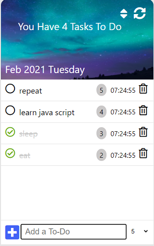

#  Pre Course Project - Todo List 📋

a link to my app: https://moran-aga.github.io/pre-course-2021-final-boilerplate/src/

This project will include most of the topics we have learnt so far.

in the to-do list the user can add a to-do by filling the input and press the plus button.
the user can choose the priority of each task and sort it by highest ppriprity by pressing the sort button on the upper right corner ofthr app. 
each task mention its ecurate creation time.

the user can rather check and uncheck the to-do when it's done, or remove it using the delete button.

The user's to-do list is stored in the local storage, so when he refreshes the page, he can always find the list there.

There is the possibility for the user, to clear the list, by clicking the button clear, at the top right corner of the app.

The to do list app, shows the today's date to the user.

i assiseted https://www.codeexplained.org/2019/03/create-to-do-list-app-in-javascript-html-css.html for inspiration

